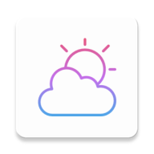

<div align="center">

  

  <h1>Weather App with Widget</h1>

  <p>Gerçek zamanlı hava durumu takibi + Ana ekran widget'ı</p>

  
  
  
  
  

</div>

---

## 📱 Uygulama

Güncel hava durumu bilgilerini sunan modern bir Android uygulaması. Uygulamayı açmana gerek kalmadan bilgilere ulaşmak için **Jetpack Glance** ile geliştirilmiş bir ana ekran widget'ı da içeriyor.

## ✨ Özellikler

| Özellik | Detay |
|---|---|
| 🌡️ Canlı Hava Durumu | Retrofit ile anlık API verisi |
| 🟧 Ana Ekran Widget'ı | **Jetpack Glance** ile Compose tabanlı widget |
| 🔄 Otomatik Güncelleme | WorkManager ile arka plan senkronizasyonu |
| 💾 Yerel Depolama | DataStore ile veri kalıcılığı |
| 🎨 Modern UI | Jetpack Compose + Material 3 |

## 🛠️ Teknoloji Yığını

```
UI          → Jetpack Compose + Material 3
Widget      → Jetpack Glance         ← ✨
DI          → Dagger Hilt
Network     → Retrofit + Gson
Storage     → DataStore
Background  → WorkManager + Hilt Worker
```

## 🏗️ Mimari

```
app/
├── data/
│   ├── api/          # Retrofit servisleri
│   └── di/           # Hilt modülleri
├── domain/           # İş mantığı
└── presentation/
    ├── ui/
    │   ├── mainScreen/   # Ana ekran
    │   └── widget/       # Jetpack Glance widget ✨
    └── theme/
```

## 🚀 Kurulum

```bash
git clone <repo-url>
cd WeatherAppWithWidget
./gradlew installDebug
```

## 📄 Lisans

Bu proje [MIT Lisansı](LICENSE) ile lisanslanmıştır.

---

<div align="center">
  <sub>Widget, <strong>Jetpack Glance</strong> kullanılarak Compose söz dizimiyle yazıldı.</sub>
</div>
